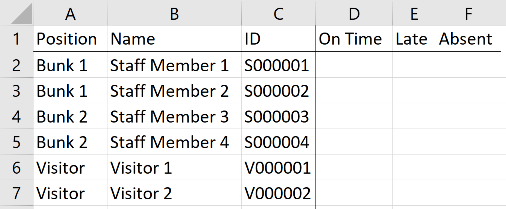
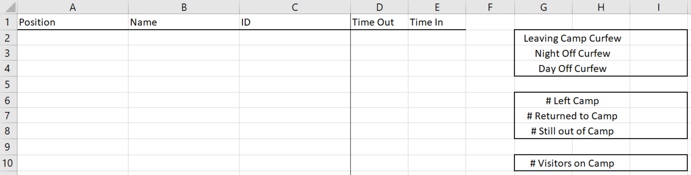
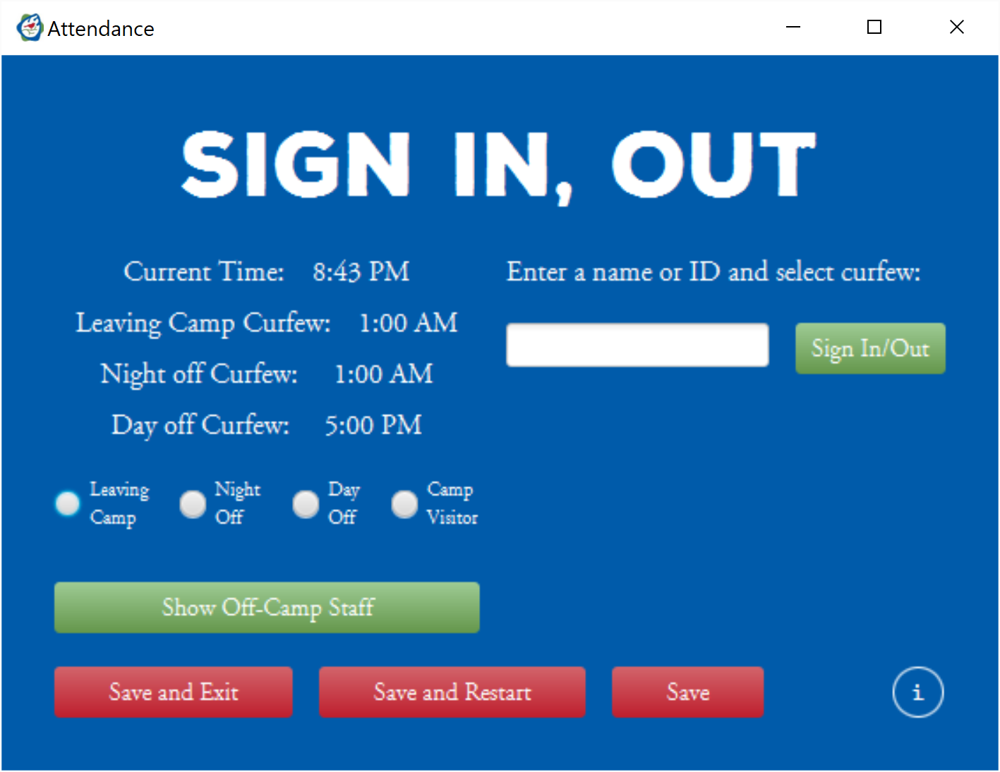
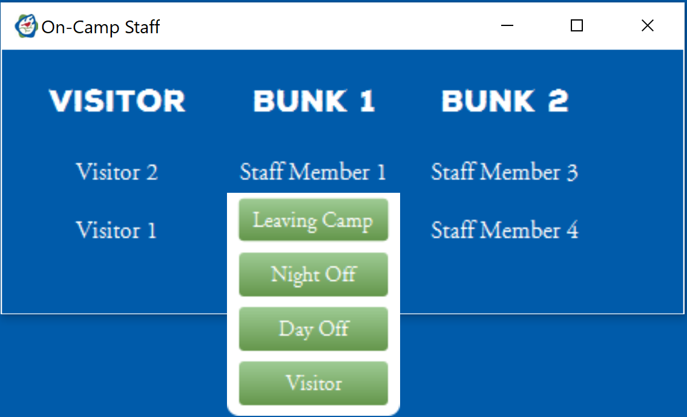
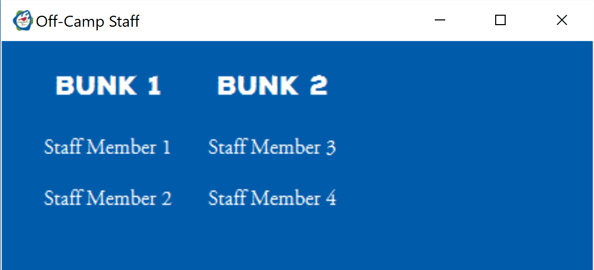
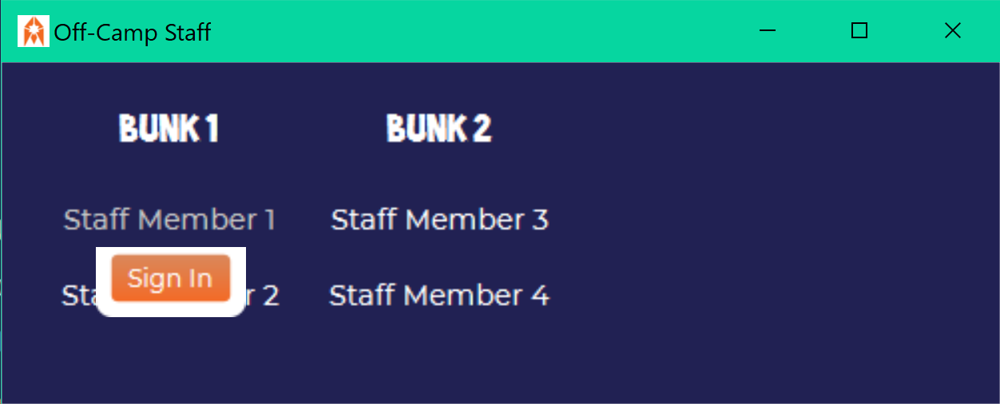

# Camp Attendance-Tracking Software <!-- omit in TOC -->

*written by Cooper Schwartz*

## **Table of Contents** <!-- omit in TOC -->
- [License](#license)
- [Instructions](#instructions)
  - [*Spreadsheet Format*](#spreadsheet-format)
    - [*Key Sheet*](#key-sheet)
    - [*Daily Attendance Template Sheet*](#daily-attendance-template-sheet)
  - [*Configuration File*](#configuration-file)
  - [*Application Use*](#application-use)
- [Changelog](#changelog)
  - [*Version 2.0 (released 5/8/2022)*](#version-20-released-582022)
  - [*Version 1.3 (released 3/12/2021)*](#version-13-released-3122021)
  - [*Version 1.2 (released 2/11/2021)*](#version-12-released-2112021)
  - [*Version 1.1 (released 8/7/2020)*](#version-11-released-872020)

## License

Copyright 2022 Cooper Schwartz

Licensed under the Apache License, Version 2.0 (the "License");
you may not use this file except in compliance with the License.
You may obtain a copy of the License at

    http://www.apache.org/licenses/LICENSE-2.0

Unless required by applicable law or agreed to in writing, software
distributed under the License is distributed on an "AS IS" BASIS,
WITHOUT WARRANTIES OR CONDITIONS OF ANY KIND, either express or implied.
See the License for the specific language governing permissions and
limitations under the License.

---

## Instructions

### *Spreadsheet Format*

I have provided a sample spreadsheet (found [here](resources/files/Sample_Attendance_File.xlsx)) to show the formatting that your spreadsheet must have to function properly. I recommend that you leave my sample as-is and either copy it or make your own for use. The sample file is saved to prefer read-only access to encourage this.

#### *Key Sheet*

  

The first sheet in the spreadsheet should be titled **Key**, and should have the format outlined below.

The first column may be titled either **Bunk** or **Position**, depending on which information you'd like to group your staff members by.

The **ID** column holds the ID that staff members sign in with (e.g. a number tied to a barcode on their ID card).

The **On Time**, **Late**, and **Absent** columns gather the respective summary statistics about how many times each staff member has been on time, late, or absent, respectively.  

Each row of the sheet represents a person (staff member or visitor). All people that might sign in or out should be listed in the sheet. For visitors, you can either list a generic "visitor" name, as I do, or update the name to match the visitor badge ID given to each visitor as they arrive.

The staff member's name should be in the **Name** column, their bunk or position in the **Position** or **Bunk** column (depending on which you're using), and their ID in the **ID** column. The **On Time**, **Late**, and **Absent** columns can either be empty or have a number in them (an empty cell is treated as if it has a 0 in it).  

#### *Daily Attendance Template Sheet*

This sheet is used as a template and is copied every day to display who was left and returned and when. I've protected the sheet in my sample to prevent changes, and I recommend you do the same in yours.

Each day, in the sheet for the day, rows will populate as people sign in and out. The leftmost three columns contain the same information as in the "Key" sheet (in fact, that information is pulled from that sheet).

The **Time Out** column displays the time that the person in this row signed out of camp. In the case of a visitor that is currently on-camp, this column will display the word "Visitor".

The **Time In** column displays the time that the person in this row signed into camp. In the case of a staff member that is currently off-cap, this column will display why the staff member left camp (e.g. "Night Off").

The blank cells in Column `I` display summary information about the day. Cells `I2`, `I3`, and `I4` display the respective curfews listed to their left. Cells `I6`, `I7`, and `I8` provide information about how many staff members have left camp, returned, and are still off-camp. Call `I10` displays the number of visitors currently on-camp.

Once you've created your spreadsheet and filled out the key sheet, save it and remember where you've saved it.

### *Configuration File*

The file in this directory named `config.ini` provides the ability to change a number of options for when the program runs. You can open this file in any text editor (e.g. Notepad). 

To change an option, simply replace the text to the right of an `=` to what you'd like the new value to be. Below are a description of the various options in this file and what they do.

**Settings you might want to change:**
- `autosave`: determines whether the **"Sign In/Out"** button also saves to the spreadsheet.
  - *Default:* `true`
  - *Constraints:* must be either `true` (autosave is on) or `false` (autosave is off).
- `attendanceFilePath`: the path to the file that you created above as an attendance file.
  - *Default:* `resources/files/Sample_Attendance_File.xlsx`
  - *Constraints:* must be a valid filepath to a `*.xlsx` file.
- `leavingCampCurfew`: the time of curfew for people leaving camp
  - *Default:* `1a`
- `nightOffCurfew`: the time of curfew for people on a night off
  - *Default:* `1a`
- `dayOffCurfew`: the time of curfew for people on a day off
  - *Default:* `5p`
- `rolloverTime`: the time that the software should automatically start the next day of attendance tracking.
  - If you don't want this to automatically happen, delete this setting from the file.
  - *Default:* `3a`
  - *Constraints for all four times:* must be a valid time. Can be written in pretty much any format you'd like:
    - 12-hour or 24-hour time (e.g. `11:00 pm`, `2300`)
    - With or without a leading zero (e.g. `01:30 AM`, `1:30 AM`)
    - With or without a colon between the hour and minute (e.g. `1700`, `17:00`)
    - With or without the minutes if on the hour (e.g. `1a`, `1:00a`)
    - With uppercase or lowercase meridiem indicators (e.g. `1:30 am`, `1:30 AM`)
    - With or without a space between the time and meridiem indicators (e.g. `5p`, `5 p`)
    - With or without the "M"/"m" in a meridiem indicator (e.g. `3a`, `3am`)
- `onTimeColor`: the color that the spreadsheet cell should be colored when a staff member signs in on time.
  - *Default:* `#b7e1cd` 
- `lateColor`: the color that the spreadsheet cell should be colored when a staff member signs in late.
  -  *Default:* `#ff3599` 
- `absentColor`: the color that the spreadsheet cell should be colored when a staff member hasn't signed in or a visitor hasn't signed out.
  -  *Default:* `#ea9999` 
- `excusedColor`: the color that the spreadsheet cell should be colored when a staff member has signed out on the first day of their day off and may not return tonight.
  -  *Default:* `#00a7e1` 
  -  *Constraints for all four colors:* must be a valid hex color code (case-insensitive).

**Settings you probably don't need to change:**
- `cssPath`: the path the the CSS file the software should use for its styling.
  - *Default:* `attendance.css`
  - *Constraints:* must be a valid filepath to a CSS file.
- `iconPath`: the path to the image that you'd like to appear as the program's icon.
  - *Default:* `file:resources/images/stage_icon.png`
  - *Constraints:* must be a valid filepath to an image file, prefixed with `file:`.
- `infoPath`: the path to the file holding the text that appears when the "info" button is clicked.
  - You may not need to change this setting, but feel free to change the contents of the referenced file.
  - *Default:* `resources/files/signInInfo.txt`
  - *Constraints:* must be a valid filepath to a text file.

### *Application Use*

This is the main window of the application. In order to sign a staff member out or a visitor in, type/scan/enter their name or ID into the text field, select the radio button for the correct curfew, and click the **Sign In/Out** button or press Enter. 

In order to sign a staff member in or a visitor out, simply type/scan/enter their name or ID into the text field, and click the **Sign In/Out** button or press Enter. There's no need to select the same radio button as previously.

Confirmation and error messages will be displayed in the area below the radio buttons.  

The **Save** button will save the current attendance record to the spreadsheet.
*Note: if the `autosave` setting is set to `true` in [`config.ini`](config.ini), clicking the **Sign In/Out** button will also save to the spreadsheet.*

The **Save and Exit** button will save the current attendance record to the spreadsheet and exit the program. If there are staff members who haven't signed in, you'll be asked to confirm that you want to mark them as absent before proceeding.

The **Save and Restart** button will save the current attendance record to the spreadsheet and restart the program. If there are staff members who haven't signed in, you'll be asked to confirm that you want to mark them as absent before proceeding.
*Note: if the `rolloverTime` setting exists in [`config.ini`](config.ini), the program will automatically save and restart at the configured time. Staff members who haven't signed in will be marked as absent without a confirmation in this case.*

**VERY IMPORTANT: Make sure you do not have your attendance spreadsheet open while attempting to write to it (*Save*, *Save and Exit*, or *Save and Restart*). The write will fail and data may be lost.**

Clicking on **Show On-Camp Staff** will pop up a list of all staff members and visitors listed in the attendance file that are currently on camp, listed by bunk/position. Clicking on the name of a person in this list will cause a dropdown to appear that allows you to manually sign them out.

Clicking on any of the buttons in the dropdown will sign the staff member or visitor out with the curfew of the selected button. *(This is the same functionality as typing the person's name into the ID box, selecting the same curfew radio button, and clicking the **Sign In/Out** button.)*

Clicking on **Show On-Camp Staff** will pop up a list of all staff members listed in the attendance file that are currently on camp, listed by bunk/position. Clicking on the name of a person in this list will cause a dropdown to appear that allows you to manually sign them in.

Clicking on any of the buttons in the dropdown will sign the staff member in. *(This is the same functionality as typing the person's name into the ID box and clicking the **Sign In/Out** button.)*

---

## Changelog

### *Version 2.0 (released 5/8/2022)*

Much has changed since `v1.3`. This is not a fully-comprehensive list of changes.

- Created `config.ini` to allow many needed settings to be easily configurable instead of requiring code changes.
- Removed the initial screen that appeared when starting the program, since the settings that were there are now set in the config file.
- Redesigned the spreadsheet.
- People can now be signed out in addition to being signed in.
- Updated UI in many locations.

### *Version 1.3 (released 3/12/2021)*

- An info button was added to the bottom right of both the initial screen and main window. Clicking on this button will provide a basic set of instructions for what to do on the current screen, as well as show the credits for this software.

### *Version 1.2 (released 2/11/2021)*

- A bug that caused a staff member to be incorrectly marked as late when curfew time hadn't yet passed was fixed.
  - This bug occured due to curfew being assumed to be on the same day as when the staff member signed in, when in reality this is not always true (e.g. if curfew is at 1:00 AM and a staff member signs in at 11:30 PM, curfew is technically the next day, and the staff member is on time).

### *Version 1.1 (released 8/7/2020)*

- A bug that caused the text reading `Current Time`, `Curfew`, and `Time until curfew` to overlap previous versions of themselves was fixed.
- In addition to the time a staff member signs in being written to the attendance `*.xlsx` file, the cell is now colored according to when the staff member signed in. This is to make seeing overall trends more easily visible at a glance.
  - A green background means that the staff member signed in on time (or was on shmira or a day off), a yellow background means that the staff members signed in after curfew, and a red background means that the staff member did not sign in at all.
